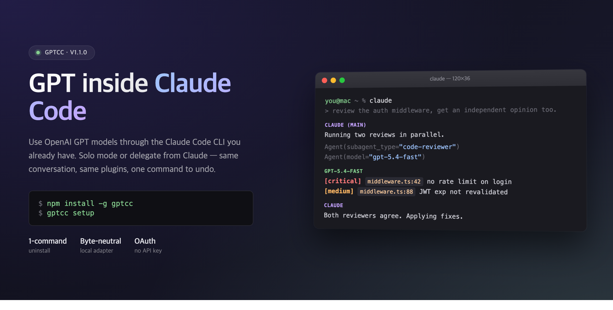
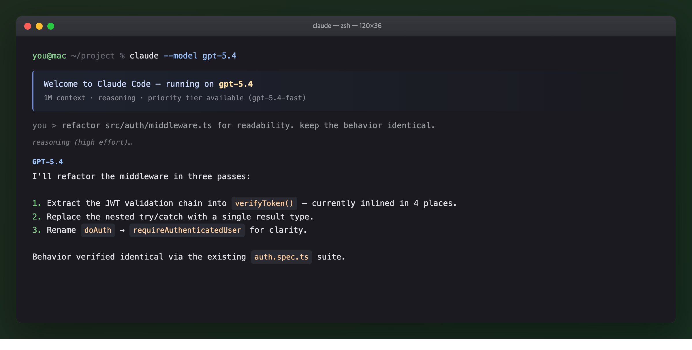
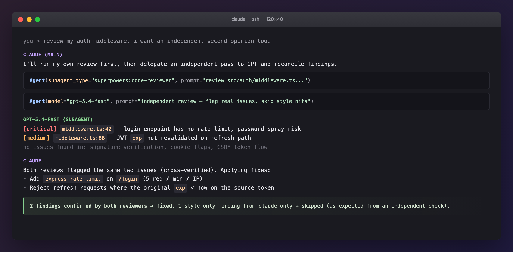
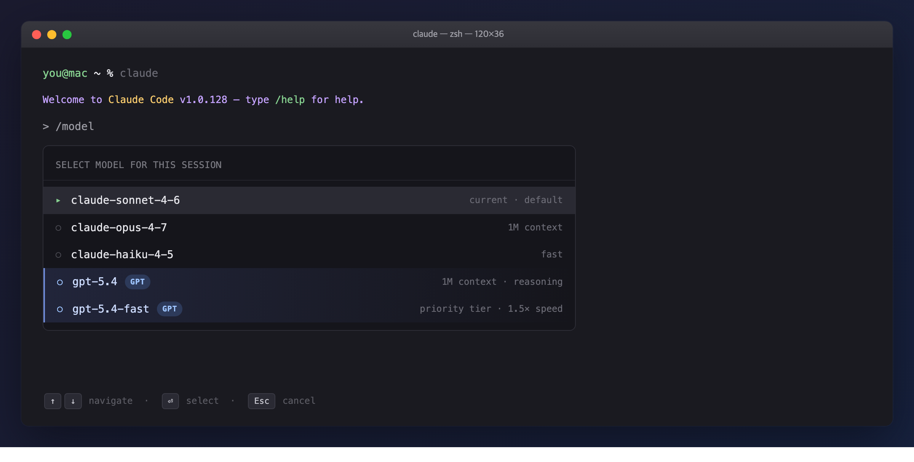

# GPT for Claude Code


Use **OpenAI GPT** models inside [Claude Code](https://claude.com/claude-code) —
same CLI, same conversation history, same Claude Code plugins and skills.
Authenticates through your existing **ChatGPT Plus/Pro** subscription via
OAuth (same flow as OpenAI's official Codex CLI). No OpenAI API key required.

<p align="center">
  
</p>

```bash
npm install -g gptcc
gptcc setup
```

> ### ℹ️ About this project
>
> gptcc uses only **documented Claude Code extension points** —
> `ANTHROPIC_BASE_URL`, `ANTHROPIC_CUSTOM_MODEL_OPTION`, and the plugin
> hook system. It does **not** modify the Claude Code binary, and does
> **not** reverse engineer anything. The ChatGPT OAuth flow is the same
> public flow OpenAI's own open-source [Codex CLI](https://github.com/openai/codex)
> uses — OpenAI explicitly supports this flow for personal, non-commercial
> use outside the Codex CLI.
>
> This is a small, non-commercial, zero-telemetry community tool. Not
> affiliated with Anthropic or OpenAI. If either party would like this
> project to wind down, see [SECURITY.md](./SECURITY.md) — we'll comply
> within 24 hours without requiring escalation.

---

## Two ways to use it

Once installed, two workflows are available. You can switch between them
any time — they're not mutually exclusive.

### Mode 1 — GPT only

Drive the whole Claude Code session with a GPT model instead of Claude.
Useful when you want GPT's behavior but still in the CLI and workflow you
already have configured.

<p align="center">
  
</p>

```bash
# Pick one of these when launching
claude --model gpt-5.4-fast
claude --model gpt-5.4

# Or switch live from inside a session
/model
```

**Best for:** solo GPT sessions where you like Claude Code's CLI/tooling
but want GPT's reasoning. Think of it as *"Claude Code UI, GPT brain."*

### Mode 2 — Claude + GPT together

Keep Claude (Opus/Sonnet) as your main driver and **delegate specific
tasks to GPT** through the `Agent` tool. This is the highest-value use
case — two differently-trained models catch different issues.

<p align="center">
  
</p>

```
Agent(subagent_type: "gpt-reviewer", prompt: "
Review src/auth/middleware.ts for real issues — skip style nits.
")
```

The installed plugin ships with ready-made subagents (`gpt-reviewer`,
`gpt-bug`, `gpt-arch`) that run on GPT and return structured findings.

**Best for:** cross-review, independent second opinions, parallel
exploration, and spec-driven generation where GPT works in isolation
while Claude keeps the main context.

#### Cross-review (the killer use case)

After a non-trivial change, run Claude and GPT reviews **in parallel** and
compare:

```
Agent(subagent_type: "code-reviewer",  prompt: "Review <files>...")
Agent(subagent_type: "gpt-reviewer",   prompt: "<same files, independent review>")
```

Common findings → fix. One-sided findings → verify before acting. This
two-pass pattern catches noticeably more real issues than either model
alone.

### The /model picker

GPT shows up in Claude Code's `/model` picker alongside Claude models —
select at any point in a session.

<p align="center">
  
</p>

### Is it a good fit?

| ✅ Good fit | ⚠️ Poor fit |
|---|---|
| Cross-review of non-trivial code | Small edits (overhead > work) |
| Architecture second opinion | Ongoing multi-turn chats where GPT loses context |
| Parallel exploration | UI / Figma / visual judgment (Claude has those integrations) |
| Spec-driven generation of an isolated module | Iterative debugging within a session |
| Using a specific GPT strength | Environment / config / local-state tasks |

A healthy multi-model workflow delegates **~10–20% of tasks, not more**.

---

## Table of Contents

- [Install](#install)
- [How it works](#how-it-works)
- [Available models](#available-models)
- [CLI commands](#cli-commands)
- [Environment variables](#environment-variables)
- [Auto-update behavior](#auto-update-behavior)
- [Architecture](#architecture)
- [Security](#security)
- [Troubleshooting](#troubleshooting)
- [Known limitations](#known-limitations)
- [Uninstall](#uninstall)
- [Contributing](#contributing)
- [FAQ](#faq)
- [License](#license)

---

## Install

### Prerequisites

- **macOS, Linux, or Windows**
- **Node.js 18+**
- **Claude Code** installed (`claude` on PATH, or set `CLAUDE_BINARY`)
- **ChatGPT Plus or Pro** subscription (required to reach GPT via Codex backend)

### One command

```bash
npm install -g gptcc
gptcc setup
```

`setup` walks through five steps:

1. Confirm the install (one-time acknowledgement).
2. Check prerequisites.
3. ChatGPT login via OAuth device-code flow.
4. Start the local proxy and write `ANTHROPIC_BASE_URL` to Claude Code
   settings once the proxy reports healthy.
5. Register `ANTHROPIC_CUSTOM_MODEL_OPTION` so GPT appears in the `/model`
   picker, then register the Claude Code plugin (for SessionStart
   auto-start of the proxy and the `gpt-*` subagents).

Verify with `gptcc status`:

```
  Proxy:     running (port 52532)
  Version:   2.0.0
  Auth:      valid (expires YYYY-MM-DD)
  Settings:  URL=OK  Picker=gpt-5.4-fast
  Platform:  darwin
```

### Choose a default model

By default gptcc registers `gpt-5.4-fast` in the `/model` picker. To pick
a different default at install time:

```bash
gptcc setup --model gpt-5.4
# or
GPTCC_DEFAULT_MODEL=gpt-5.4-mini gptcc setup
```

You can still invoke other GPT models inside the session (subagent
frontmatter, direct `claude --model <id>`, etc.) — the proxy routes any
`gpt-*` identifier to the Codex backend.

---

## How it works

```
┌─────────────────┐
│   Claude Code   │
│ (Opus / Sonnet) │
└────────┬────────┘
         │ Anthropic Messages API
         │ ANTHROPIC_BASE_URL=http://127.0.0.1:52532
         ▼
┌─────────────────────────────────────────┐
│     gptcc — local proxy (127.0.0.1)     │
│                                         │
│     Route by model name:                │
│     ├─ claude-*  → Anthropic API        │
│     └─ gpt-*, o* → Codex backend        │
│        (with Claude→GPT prompt rewrite) │
└────────┬─────────────────┬──────────────┘
         │                 │
         ▼                 ▼
  api.anthropic.com    chatgpt.com/backend-api/codex
                       (OAuth, ChatGPT subscription)
```

Two components do the work:

1. **Local proxy** (`lib/proxy.mjs`) — translates Anthropic Messages API ↔
   OpenAI Responses API, and rewrites Claude-specific system prompts
   into GPT-appropriate ones (strips Claude identity and meta-instructions,
   keeps only your CLAUDE.md content verbatim).

2. **Plugin** (`plugin/`) — registers the GPT subagents for Mode 2, and a
   `SessionStart` hook that ensures the proxy is running. Pure
   configuration; no binary modification anywhere.

---

## Available models

| Model | Notes |
|---|---|
| `gpt-5.4` | Flagship, 1M context, reasoning support |
| `gpt-5.4-fast` | Same model, priority tier (1.5× speed, 2× credits) |
| `gpt-5.4-mini` | Lightweight |
| `gpt-5.3-codex` | Coding-specialized |
| `gpt-5.3-codex-spark` | Real-time coding iteration |
| `gpt-5.2` | Previous generation |

---

## CLI commands

| Command | Purpose |
|---|---|
| `gptcc setup [--model <id>]` | One-touch install |
| `gptcc setup --multi-slot` | Install with 4-GPT picker mode |
| `gptcc login` | Re-login to ChatGPT |
| `gptcc doctor` | 5-layer self-diagnostic with fix hints |
| `gptcc hello` | End-to-end smoke test |
| `gptcc status` | Show proxy / auth / settings / platform |
| `gptcc proxy` | Run the proxy in foreground (debug) |
| `gptcc uninstall` | Remove everything |
| `gptcc help` | Show help |

---

## Environment variables

**Basic**

| Variable | Default | Purpose |
|---|---|---|
| `GPT_PROXY_PORT` | `52532` | Port the local proxy binds to |
| `GPTCC_DEFAULT_MODEL` | `gpt-5.4-fast` | Default model registered in `/model` picker during setup |
| `GPTCC_NO_UPDATE` | — | Set to `1` to disable the npm auto-update check |
| `GPTCC_DEBUG` | — | Set to `1` for verbose proxy logging |
| `GPTCC_ACCEPT` | — | Set to `1` to skip the interactive consent prompt (non-interactive installs) |
| `CLAUDE_BINARY` | platform-specific | Path to the Claude Code binary |

**Upstream endpoints** (for testing / future API changes)

| Variable | Default |
|---|---|
| `ANTHROPIC_API_ENDPOINT` | `https://api.anthropic.com` |
| `CODEX_API_ENDPOINT` | `https://chatgpt.com/backend-api/codex` |
| `OPENAI_TOKEN_ENDPOINT` | `https://auth.openai.com/oauth/token` |
| `CODEX_AUTH_PATH` | `~/.codex/auth.json` |
| `CODEX_CLIENT_ID` | public Codex CLI ID (same as openai/codex) |

**Reasoning effort mapping** (Claude `budget_tokens` → GPT effort)

- `REASONING_LOW_MAX` (default `2000`)
- `REASONING_MEDIUM_MAX` (default `8000`)
- `REASONING_HIGH_MAX` (default `20000`)

---

## Auto-update behavior

On most CLI invocations, `gptcc` checks npm for a newer version (24h
cached). A new version is installed and the command re-runs automatically.

Skipped for: `setup`, `login`, `uninstall`, `status`, `help` (these need
to work offline).

Disable globally with `GPTCC_NO_UPDATE=1`.

---

## Architecture

```
gptcc/
├── bin/gptcc.mjs             # CLI entry
├── lib/
│   ├── login.mjs             # OAuth device code flow
│   ├── setup.mjs             # Cross-platform installer / uninstaller / status
│   ├── updater.mjs           # npm auto-update (24h cached)
│   └── proxy.mjs             # HTTP proxy (Anthropic ↔ OpenAI translation)
├── mcp/server.mjs            # MCP server (ask_gpt54, review_with_gpt54)
├── plugin/                   # Claude Code plugin
│   ├── .claude-plugin/
│   ├── hooks/
│   │   ├── hooks.json        # SessionStart hook
│   │   └── start-proxy.mjs   # cross-platform proxy starter
│   ├── agents/               # gpt-reviewer, gpt-bug, gpt-arch subagents
│   └── skills/orchestration/ # Prompt templates + delegation rules
└── package.json
```

### How the proxy handles prompts

Claude Code's system prompt is long (5–10 KB) and contains Claude-specific
identity, workflow rules, and tone guidance. Forwarding that verbatim to
GPT produces worse output than a clean prompt — GPT isn't Claude and
shouldn't follow Claude's tone rules.

When a request targets a GPT model, the proxy:

1. Detects whether the system prompt is Claude Code's main prompt (not a
   subagent).
2. Extracts only the user's content (CLAUDE.md section).
3. Composes a minimal GPT system prompt: role + tool policy + user
   instructions.
4. Discards Claude identity, workflow rules, and tone guidance.

Subagent system prompts (from `Agent(...)`) are passed through as-is since
they're already task-specific.

---

## Security

Core properties:

- Proxy binds to `127.0.0.1` only (never exposed on a public interface).
- OAuth tokens in `~/.codex/auth.json` with `0o600` permissions
  (platform-appropriate on non-POSIX systems).
- Auth file written atomically to prevent corruption.
- Anthropic passthrough restricted to `/v1/*` paths (SSRF prevention).
- OAuth Client ID is the public Codex CLI ID used by OpenAI's open-source
  `codex` tool.
- Zero telemetry, zero third-party services, zero monetization.

What this tool does **not** do:

- Modify the Claude Code binary.
- Reverse engineer anything.
- Send anything beyond the proxied API calls.
- Retain or log request contents.
- Collect or transmit user data to any third party.

For the full security policy and threat model, see [SECURITY.md](./SECURITY.md).

---

## Troubleshooting

### Proxy not running
```bash
gptcc proxy   # run in foreground to see startup errors
```

### "Codex backend error" or 401
OAuth expired. Re-login:
```bash
gptcc login
```

### GPT doesn't appear in `/model` picker
Usually a stale session — restart Claude Code. If still missing, check
that `settings.json` contains the `ANTHROPIC_CUSTOM_MODEL_OPTION` key:
```bash
gptcc status
```

### Plugin hook not starting proxy
Confirm the plugin is registered:
```bash
claude plugin list
```
Re-register: `claude plugin add <path-to-gptcc>/plugin`.

---

## Known limitations

- **ChatGPT Free accounts don't work** — the Codex backend requires a paid
  ChatGPT subscription.
- **No OpenAI API key path** — this routes through the Codex backend via
  ChatGPT OAuth. API-key-based access would require a separate code path.
- **Default installs expose one GPT entry in `/model`** — for four GPT
  entries, install with `gptcc setup --multi-slot` (uses Claude Code's
  `CLAUDE_CODE_USE_BEDROCK=1` mode plus the proxy's Bedrock-compatible
  endpoint).

---

## Uninstall

**One command. Restores everything. Safe to run any time.**

```bash
gptcc uninstall
npm uninstall -g gptcc
```

Restores:

- **Claude Code settings** — `ANTHROPIC_BASE_URL` and
  `ANTHROPIC_CUSTOM_MODEL_OPTION` entries removed from
  `~/.claude/settings.json`. Legacy keys from `< 2.0` installs also
  cleaned up.
- **Installed files** — `~/.local/share/gptcc/` removed.
- **Legacy launchd agents** (macOS only) — any `com.gptcc.*` plist from
  `< 2.0` installs unloaded and removed.
- **Legacy binary backup** (from `< 2.0` installs) — if a
  `~/.local/bin/claude.backup` exists from an earlier binary-adapter
  version, Claude Code is restored from it.

Does **not** remove:

- `~/.codex/auth.json` — your ChatGPT OAuth tokens. Left in place because
  the official Codex CLI shares this file. Delete manually for a fully
  clean slate.
- Claude Code plugin registration — run `claude plugin remove gptcc` if
  you registered it.

---

## Contributing

Community contributions are welcome. Start here:

- **[CONTRIBUTING.md](./CONTRIBUTING.md)** — development setup, contribution
  workflows, coding style, and testing
- **[CODE_OF_CONDUCT.md](./CODE_OF_CONDUCT.md)** — community expectations
- **[SECURITY.md](./SECURITY.md)** — security policy and reporting
- **[CHANGELOG.md](./CHANGELOG.md)** — release history

Good first contributions:

- Reports for new Claude Code or Codex API behaviors
- Proxy translation improvements (edge cases in streaming, tool use)
- New GPT subagent templates under `plugin/agents/`
- Windows and Linux platform polish

---

## FAQ

**Q: Is this an official Anthropic or OpenAI product?**
No. It's a small community tool built by and for developers who use both
platforms. Not affiliated with, endorsed by, or sponsored by Anthropic or
OpenAI. All trademarks belong to their respective owners; their use here
is nominative fair use, solely to describe what this tool interoperates
with.

**Q: Does this violate Anthropic's Terms of Service?**
No reverse engineering, no binary modification, no bypass of
authentication. gptcc uses only the documented Claude Code extension
points:

- [`ANTHROPIC_BASE_URL`](https://code.claude.com/docs/en/llm-gateway) for
  routing through a local proxy.
- [`ANTHROPIC_CUSTOM_MODEL_OPTION`](https://code.claude.com/docs/en/model-config)
  for registering the GPT model in the `/model` picker.
- Plugin hooks (`SessionStart`) for starting the proxy.

These are the same mechanisms Claude Code's documentation shows for
LiteLLM, LM Studio, Ollama, and vLLM.

**Q: Does this violate OpenAI's Terms of Service?**
OpenAI explicitly supports using the Codex OAuth flow outside the Codex
CLI for personal, non-commercial use. gptcc uses the public OAuth client
ID from OpenAI's open-source [`openai/codex`](https://github.com/openai/codex)
— the flow is identical. OpenAI's stated restrictions ("not for commercial
services, API resale, or multi-user applications") don't apply to a
personal local dev tool like gptcc.

**Q: Could my ChatGPT or Anthropic account be affected?**
Unlikely in normal use. The OAuth side is indistinguishable from the
official Codex CLI, and the Claude side uses only documented extension
points. If you're cautious, use a separate test ChatGPT account while you
try it.

**Q: Reversible?**
Yes, fully. `gptcc uninstall` removes everything and restores your
`settings.json`. No binary is modified, so there's nothing to restore at
the OS level.

**Q: Will this become unnecessary?**
We hope so. If Claude Code adds a first-class multi-provider UI (say, a
plugin that contributes picker entries and handles OpenAI auth natively),
this tool is no longer needed and we'll happily deprecate it with a
pointer to the official mechanism.

**Q: Is this faster than Codex CLI for pure GPT work?**
No — it adds a small proxy hop. Use this for *integration* with Claude
Code workflows, not for faster GPT alone. If all you want is GPT in a
terminal, use Codex CLI directly — it's the right tool for that job.

**Q: Can GPT match Claude's quality inside Claude Code?**
Varies by task. GPT does some things better, Claude does others. The
value is having both available in the same session, not one being
universally better. Most of our own usage is Claude as the main session
with selective GPT delegation (code review, independent second opinion,
specialized generation tasks).

**Q: Why strip Claude's system prompt when calling GPT?**
Claude Code's system prompt contains Anthropic-specific identity, tone
guidance, and workflow rules tuned for Claude. Feeding those to GPT makes
GPT perform worse than giving it a clean, task-specific prompt. So when
the proxy routes to a GPT model, it extracts only your CLAUDE.md content
and composes a minimal GPT-appropriate system prompt.

**Q: Why only one GPT model in the `/model` picker?**
`ANTHROPIC_CUSTOM_MODEL_OPTION` currently accepts a single entry. You can
still use other GPT variants inside the session — the proxy routes any
`gpt-*` identifier to the Codex backend. A future release (Phase B) will
add a Bedrock-compatible endpoint path so multiple GPT entries can share
the picker at once.

---

## License

MIT — see [LICENSE](./LICENSE).

Not affiliated with, endorsed by, or sponsored by Anthropic, OpenAI, or
ChatGPT. All trademarks belong to their respective owners; their use in
this repository is nominative fair use, solely to describe what this tool
interoperates with.
