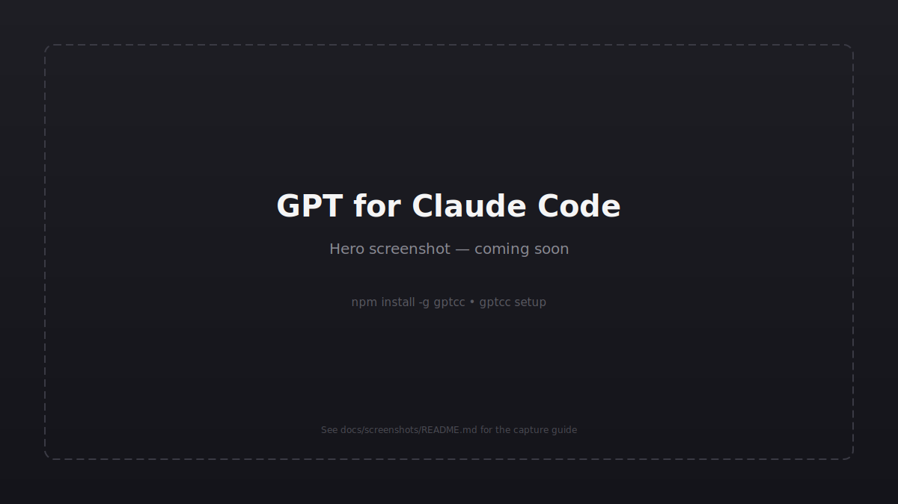
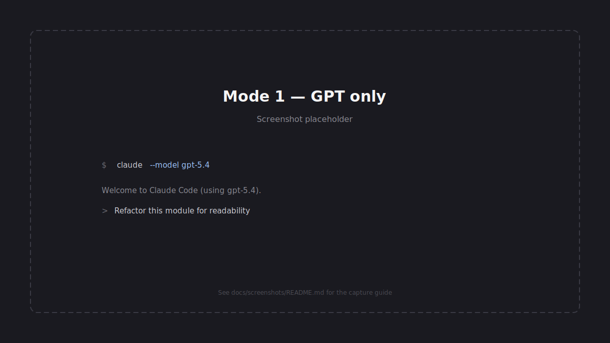
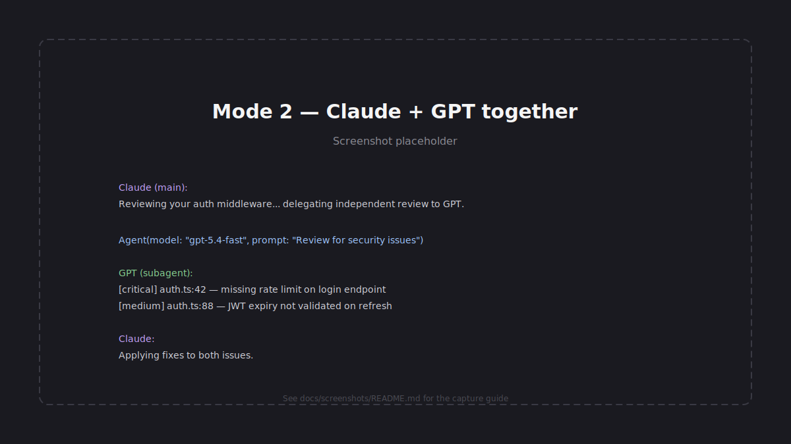
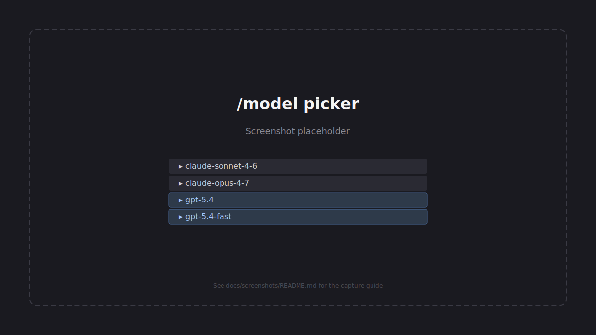

# GPT for Claude Code


Use **OpenAI GPT** models inside [Claude Code](https://claude.com/claude-code) —
same CLI, same conversation history, same Claude Code plugins and skills.
No OpenAI API key required; authenticates via your existing ChatGPT (Plus/Pro)
subscription through OAuth.

<p align="center">
  
</p>

```bash
npm install -g gptcc
gptcc setup
```

> ### ℹ️ About this project
>
> GPT for Claude Code is a **community interoperability tool for personal
> development environments**. It works by locally adapting a copy of Claude
> Code on your own machine — no modified binaries are redistributed, and the
> change is fully reversible with `gptcc uninstall` (backups are always
> preserved).
>
> Claude Code doesn't officially support third-party models yet. If and when
> Anthropic adds a public provider API, we'll happily deprecate this tool in
> favor of it. Until then, this lets individual developers experiment with
> multi-model workflows without losing the Claude Code experience they're
> used to.
>
> Best for individual developers. **Not designed for enterprise or
> compliance-sensitive environments** — if your organization has a software
> modification policy, this tool is not for you. See
> [FAQ: Is this against Anthropic's ToS?](#faq) and
> [TAKEDOWN_POLICY.md](./TAKEDOWN_POLICY.md).

---

## Two ways to use it

Once installed, two workflows are available. You can switch between them any
time — they're not mutually exclusive.

### Mode 1 — GPT only

Drive the whole Claude Code session with a GPT model instead of Claude.
Useful when you want GPT's behavior, but still in the CLI and workflow you
already have configured.

<p align="center">
  
</p>

```bash
# Pick one of these when launching
claude --model gpt-5.4
claude --model gpt-5.4-fast

# Or switch live from inside a session
/model
```

**Best for:** solo GPT sessions where you like Claude Code's CLI/tooling but
want GPT's reasoning. Think of it as "Claude Code UI, GPT brain."

### Mode 2 — Claude + GPT together

Keep Claude (Opus/Sonnet) as your main driver and **delegate specific tasks
to GPT** through the `Agent` tool. This is the highest-value use case — two
differently-trained models catch different issues.

<p align="center">
  
</p>

```
Agent(model: "gpt-5.4-fast", prompt: "
## Task
Independent code review — flag real issues, skip style nits.

## Intent
This middleware validates JWT tokens and sets req.user.

## Code
[paste diff or file]

## Output format
- [severity: critical|high|medium|low] file:line
  Problem: ...
  Evidence: ...
  Fix: ...
")
```

**Best for:** cross-review, independent second opinions, parallel
exploration, and spec-driven generation where GPT works in isolation while
Claude keeps the main context. The installed orchestration skill
([`plugin/skills/orchestration/SKILL.md`](./plugin/skills/orchestration/SKILL.md))
contains ready-to-use templates for code generation, review, bug analysis,
and architecture second-opinion prompts.

#### Cross-review (the killer use case)

After a non-trivial change, run Claude and GPT reviews **in parallel** and
compare:

```
Agent(subagent_type: "superpowers:code-reviewer", prompt: "Review <files>...")
Agent(model: "gpt-5.4-fast",                     prompt: "<independent review template>")
```

Common findings → fix. One-sided findings → verify before acting. This
two-pass pattern catches noticeably more real issues than either model alone.

### The /model picker

Both modes show up in Claude Code's `/model` picker — Claude and GPT models
live side-by-side, and you switch between them at any point in the session.

<p align="center">
  
</p>

### Is it a good fit?

| ✅ Good fit | ⚠️ Poor fit |
|---|---|
| Cross-review of non-trivial code | Small edits (overhead > work) |
| Architecture second opinion | Ongoing multi-turn chats (GPT loses context) |
| Parallel exploration | UI / Figma / visual judgment (Claude has those integrations) |
| Spec-driven generation of an isolated module | Iterative debugging within a session |
| Using a specific GPT strength | Environment / config / local-state tasks |

A healthy multi-model workflow delegates **~10–20% of tasks, not more**.

---

## Table of Contents

- [Install](#install)
- [How it works](#how-it-works)
- [Available models](#available-models)
- [CLI commands](#cli-commands)
- [Environment variables](#environment-variables)
- [Auto-update behavior](#auto-update-behavior)
- [Architecture](#architecture)
- [Security](#security)
- [Troubleshooting](#troubleshooting)
- [Known limitations](#known-limitations)
- [Uninstall](#uninstall)
- [Contributing](#contributing)
- [FAQ](#faq)
- [License](#license)

---

## Install

### Prerequisites

- **macOS** (Linux/Windows support welcome via PR)
- **Node.js 18+**
- **Python 3.8+**
- **Claude Code** installed (default path: `~/.local/bin/claude`)
- **ChatGPT Plus or Pro** subscription (Codex backend requires paid ChatGPT)

### One command

```bash
npm install -g gptcc
gptcc setup
```

`setup` walks through seven steps:

1. ChatGPT login via OAuth device-code flow
2. Configure Claude Code settings
3. Adapt the binary so GPT models are recognized
4. Start the proxy (auto-verifies `/health` before committing `ANTHROPIC_BASE_URL`)
5. Install launchd agents for auto-start and auto-repatch
6. Register the Claude Code plugin (orchestration skill + SessionStart hook)

Verify with `gptcc status`:

```
  Proxy:     running (port 52532)
  Auth:      valid (expires YYYY-MM-DD)
  Adapter:   applied
  Settings:  URL=OK Models=OK
```

---

## How it works

```
┌─────────────────┐
│   Claude Code   │
│  (Opus / etc.)  │
└────────┬────────┘
         │ Anthropic Messages API
         │ ANTHROPIC_BASE_URL=http://127.0.0.1:52532
         ▼
┌─────────────────────────────────────────┐
│   GPT for Claude Code — local proxy     │
│                                         │
│   Route by model name:                  │
│   ├─ claude-*     → Anthropic API       │
│   └─ gpt-*, o*    → Codex backend       │
│      (with Claude→GPT prompt rewrite)   │
└────────┬─────────────────┬──────────────┘
         │                 │
         ▼                 ▼
  api.anthropic.com    chatgpt.com/backend-api/codex
                       (OAuth, ChatGPT subscription)
```

Two components do all the work:

1. **Local proxy** (`lib/proxy.mjs`) — translates Anthropic Messages API ↔
   OpenAI Responses API, and rewrites Claude-specific system prompts into
   GPT-appropriate ones (strips Claude identity and meta-instructions,
   keeps only your CLAUDE.md content verbatim).

2. **Binary adapter** (`scripts/patch-claude.py`) — a small, byte-length-
   neutral, reversible local modification that lets Claude Code's `/model`
   picker and Agent tool enum recognize GPT model identifiers. Uses
   structural regex so it adapts to minifier renames between Claude Code
   releases.

---

## Available models

| Model | Notes |
|---|---|
| `gpt-5.4` | Flagship, 1M context, reasoning support |
| `gpt-5.4-fast` | Same model, priority tier (1.5× speed, 2× credits) |
| `gpt-5.4-mini` | Lightweight |
| `gpt-5.3-codex` | Coding-specialized |
| `gpt-5.3-codex-spark` | Real-time coding iteration |
| `gpt-5.2` | Previous generation |

---

## CLI commands

| Command | Purpose |
|---|---|
| `gptcc setup` | One-touch install (login + settings + adapter + proxy + launchd + plugin) |
| `gptcc login` | Re-login to ChatGPT |
| `gptcc status` | Show proxy / auth / adapter / settings status |
| `gptcc patch` | Re-apply the binary adapter manually |
| `gptcc patch --restore` | Reinstate the original Claude Code binary from backup |
| `gptcc diagnose` | Show which adapter patterns match / fail (dry run) |
| `gptcc proxy` | Run the proxy in foreground (debug) |
| `gptcc uninstall` | Remove everything and restore the original Claude Code |
| `gptcc help` | Show help |

---

## Environment variables

**Basic**

| Variable | Default | Purpose |
|---|---|---|
| `GPT_PROXY_PORT` | `52532` | Port the local proxy binds to |
| `GPTCC_NO_UPDATE` | — | Set to `1` to disable the npm auto-update check |
| `GPTCC_DEBUG` | — | Set to `1` for verbose logging (unknown SSE events, undici status) |
| `GPTCC_ACCEPT_RISK` | — | Set to `1` to skip the interactive consent prompt (non-interactive installs) |
| `CLAUDE_BINARY` | `~/.local/bin/claude` | Path to the Claude Code binary |
| `GPT_MODELS` | `gpt-5.4,gpt-5.4-fast` | Comma-separated list of models to inject into the picker |

**Upstream endpoints** (for testing / future API changes)

| Variable | Default |
|---|---|
| `ANTHROPIC_API_ENDPOINT` | `https://api.anthropic.com` |
| `CODEX_API_ENDPOINT` | `https://chatgpt.com/backend-api/codex` |
| `OPENAI_TOKEN_ENDPOINT` | `https://auth.openai.com/oauth/token` |
| `CODEX_AUTH_PATH` | `~/.codex/auth.json` |
| `CODEX_CLIENT_ID` | public Codex CLI ID |

**Model configuration**

- `OPENAI_MODEL_PREFIXES` — extra prefixes to recognize as OpenAI (comma-separated)
- `OPENAI_VIRTUAL_MODELS` — JSON: `{"alias": {"actual": "gpt-5.4", "fast": true}}`

**Reasoning effort mapping** (Claude `budget_tokens` → GPT effort)

- `REASONING_LOW_MAX` (default `2000`)
- `REASONING_MEDIUM_MAX` (default `8000`)
- `REASONING_HIGH_MAX` (default `20000`)

---

## Auto-update behavior

Two independent update mechanisms — they cover most failure modes without
you having to do anything.

### 1. gptcc self-update

On most CLI invocations, `gptcc` checks npm for a newer version (24h
cached). A new version is auto-installed and the command re-runs.

Skipped for: `setup`, `login`, `uninstall`, `status`, `diagnose`, `help`
(these need to work offline).

Disable globally with `GPTCC_NO_UPDATE=1`.

### 2. Claude Code update handler

launchd watches `~/.local/bin/claude`. When it changes:

```
Claude Code update detected
  ↓
autopatch.sh
  ├─ Try re-apply with current gptcc      → notify "patched"
  └─ Fail → npm install -g gptcc@latest   → retry
      ├─ Succeed                           → notify "updated to X.Y.Z + patched"
      └─ Fail                              → notify "Run: gptcc diagnose"
```

---

## Architecture

```
gptcc/
├── bin/gptcc.mjs         # CLI entry
├── lib/
│   ├── login.mjs         # OAuth device code flow
│   ├── setup.mjs         # One-touch installer
│   ├── updater.mjs       # npm auto-update (24h cached)
│   └── proxy.mjs         # HTTP proxy (Anthropic ↔ OpenAI translation)
├── scripts/
│   ├── patch-claude.py   # Binary adapter
│   └── autopatch.sh      # launchd handler
├── mcp/server.mjs        # MCP server (ask_gpt54, review_with_gpt54)
├── plugin/               # Claude Code plugin
│   ├── .claude-plugin/
│   ├── hooks/hooks.json  # SessionStart hook
│   └── skills/orchestration/   # Prompt templates + delegation rules
└── package.json
```

### How the proxy handles prompts

Claude Code's system prompt is long (5–10 KB) and contains Claude-specific
identity, workflow rules, and tone guidance. Forwarding that verbatim to
GPT produces worse output than a clean prompt — GPT isn't Claude and
shouldn't follow Claude's tone rules.

When a request targets a GPT model, the proxy:

1. Detects whether the system prompt is Claude Code's main prompt (not a
   subagent).
2. Extracts only the user's content (CLAUDE.md section).
3. Composes a minimal GPT system prompt: role + tool policy + user
   instructions.
4. Discards Claude identity, workflow rules, and tone guidance.

Subagent system prompts (from `Agent(...)`) are passed through as-is since
they're already task-specific.

### Binary adapter details

Uses **structural regex** (not exact-name matching) so it adapts to
minifier renames between Claude Code releases. Patterns:

- `model_defs` — sonnet/haiku variable definitions (supports `$`-prefixed names)
- `agent_enum` — `.enum([...])` for the Agent tool's model validation
- `context_1m` — 1M-context detection function (extended to recognize GPT models)
- `context_absorber` / `model_check_3way` — nearby functions shortened for byte-balancing
- `picker_return_*` — picker branches needing GPT model injection

All adaptations are **byte-length-neutral** (space padding). Binary size is
verified unchanged before writing. The adapted binary is re-signed with an
ad-hoc signature.

---

## Security

Core properties:

- Proxy binds to `127.0.0.1` only (never exposed on a public interface)
- OAuth tokens in `~/.codex/auth.json` with `0o600` permissions
- Auth file written atomically to prevent corruption
- Anthropic passthrough restricted to `/v1/*` paths (SSRF prevention)
- OAuth Client ID is the same public Codex CLI ID used by OpenAI's
  open-source `codex` tool
- Zero telemetry, zero third-party services, zero monetization

What this tool does **not** do:

- Modify behavior for Claude models (pure passthrough when you pick a Claude model)
- Send anything beyond the proxied API calls
- Retain or log request contents
- Redistribute modified Claude Code binaries
- Collect or transmit user data to any third party

For the full security policy and threat model, see [SECURITY.md](./SECURITY.md).

---

## Troubleshooting

### Proxy not starting
```bash
tail -f ~/Library/Logs/gptcc-proxy.log
```

### "Codex backend error" or 401
OAuth expired. Re-login:
```bash
gptcc login
```

### GPT models missing from `/model` after a Claude Code update
Adapter was wiped by the update. Auto-patch should run automatically;
check the log:
```bash
tail -f ~/Library/Logs/gptcc-patch.log
```

If auto-patch fails, run diagnostics:
```bash
gptcc diagnose
```

This shows which patterns matched and which failed, with partial-match
context to help you (or the maintainers) fix the regex.

### Agent tool: "Invalid option: expected one of sonnet|opus|haiku"
The session was started before the binary was adapted. Restart Claude Code.

### Claude Code won't launch
Restore the original binary immediately:
```bash
gptcc patch --restore
```

Or directly:
```bash
python3 ~/.local/share/gptcc/patch-claude.py --restore
```

---

## Known limitations

- **Claude Code updates wipe the adapter.** Auto-patch catches most minor
  updates. Major internal restructures require a patch-script update.
- **macOS only** for now. Proxy and OAuth code are portable; setup scripts
  aren't.
- **Sonnet/Haiku picker labels** don't always show version numbers (e.g.
  "Sonnet" instead of "Sonnet 4.6"). Depends on which internal code path
  Claude Code chooses for your account. Functionality is unaffected.
- **ChatGPT Free accounts don't work.** Codex backend requires paid ChatGPT.
- **No OpenAI API key support.** This routes through the Codex backend
  (ChatGPT OAuth). Direct `api.openai.com` support would require a separate
  code path.

---

## Uninstall

**One command. Restores everything. Safe to run any time.**

```bash
gptcc uninstall
npm uninstall -g gptcc
```

Restores:

- **Claude Code binary** — reinstated from the backup saved before the
  first adaptation (`~/.local/bin/claude.backup`). Original bytes, original
  signature path, original behavior.
- **Claude Code settings** — `ANTHROPIC_BASE_URL` env entry and GPT entries
  under `availableModels` removed from `~/.claude/settings.json`.
- **launchd agents** — proxy-runner and auto-patch watcher unloaded and
  removed.
- **Installed scripts** — `~/.local/share/gptcc/` directory removed.

Does **not** remove:

- `~/.codex/auth.json` — your ChatGPT OAuth tokens. Left in place because
  the official Codex CLI shares this file. Delete manually if you want a
  fully clean slate.
- Claude Code plugin registration — run `claude plugin remove gptcc`
  separately if you registered it.

If you ever have doubts about current state, `gptcc status` tells you
exactly what's currently modified, and `gptcc patch --restore` on its own
reinstates just the binary.

---

## Contributing

Community contributions are welcome. Start here:

- **[CONTRIBUTING.md](./CONTRIBUTING.md)** — development setup, contribution
  workflows, and the detailed guide for the most common contribution (updating
  the adapter patterns after a Claude Code release)
- **[CODE_OF_CONDUCT.md](./CODE_OF_CONDUCT.md)** — community expectations
- **[SECURITY.md](./SECURITY.md)** — security policy and reporting
- **[CHANGELOG.md](./CHANGELOG.md)** — release history

The most common contribution type is updating the adapter after a Claude
Code release. `gptcc diagnose` output plus a PR updating `PATTERNS` in
`scripts/patch-claude.py` is usually enough.

---

## FAQ

**Q: Is this an official Anthropic or OpenAI product?**
No. It's a small community tool built by and for developers who use both
platforms. Not affiliated with, endorsed by, or sponsored by Anthropic or
OpenAI. All trademarks belong to their respective owners; their use here is
nominative fair use, solely to describe what this tool interoperates with.

**Q: Is this against Anthropic's Terms of Service?**
Honestly — it's a gray area, and we want to be straightforward about that.

This tool locally adapts a copy of Claude Code on your own machine so the
model picker recognizes additional model identifiers. We believe this is
defensible under the DMCA §1201(f) interoperability exception, 17 U.S.C.
§117(a) (the owner's right to adapt software for their own use), and the
Sega v. Accolade line of cases on reverse engineering for interoperability.
No modified binary is ever redistributed.

That said, reasonable people may read the Anthropic ToS differently, and
we respect Anthropic's right to clarify their position. That's exactly why
we publish a [TAKEDOWN_POLICY.md](./TAKEDOWN_POLICY.md) with a 24-hour
compliance SLA — if Anthropic (or anyone with standing) formally asks us to
wind this down, we will, without forcing escalation.

In practice: this is fine for individual developers experimenting with
multi-model workflows on their own machine. It is **not appropriate** for
corporate environments with software modification policies, for shared or
production systems, or as part of a commercial product. If you're unsure
whether it applies to your situation, assume it does and don't install.

**Q: Could my ChatGPT or Anthropic account be affected?**
The OAuth side is indistinguishable from the official Codex CLI (same
public client ID, same endpoints), so the ChatGPT side looks normal.
The binary adaptation is entirely local — Anthropic's API doesn't see
anything different from a regular Claude Code install. We've seen no
reports of accounts being actioned for this, but we can't guarantee it.
If you're cautious, use a separate test ChatGPT account while you try it.

**Q: What if I change my mind? Is it really reversible?**
Yes — and we take that seriously. A backup of the original binary is saved
before the first adaptation, and `gptcc uninstall` restores Claude Code to
its original state in one command. `gptcc patch --restore` does the same
for just the binary. `gptcc status` shows exactly what's currently
modified. See [Uninstall](#uninstall) for the full picture.

**Q: Will this become unnecessary?**
We hope so. If Anthropic adds official support for third-party model
providers in Claude Code, this tool is no longer needed, and we'll happily
deprecate it with a pointer to the official mechanism. Until then, this
lets individual developers bridge the gap without leaving the Claude Code
environment they've invested in.

**Q: Is this faster than Codex CLI for pure GPT work?**
No — it adds a small proxy hop. Use this for *integration* with Claude
Code workflows, not for faster GPT alone. If all you want is GPT in a
terminal, use Codex CLI directly — it's the right tool for that job.

**Q: Can GPT match Claude's quality inside Claude Code?**
Varies by task. GPT does some things better, Claude does others. The value
is having both available in the same session, not one being universally
better. Most of our own usage is Claude as the main session with selective
GPT delegation (code review, independent second opinion, specialized
generation tasks).

**Q: Why strip Claude's system prompt when calling GPT?**
Claude Code's system prompt contains Anthropic-specific identity, tone
guidance, and workflow rules tuned for Claude. Feeding those to GPT makes
GPT perform worse than giving it a clean, task-specific prompt. So when
the proxy routes to a GPT model, it extracts only your CLAUDE.md content
and composes a minimal GPT-appropriate system prompt. Claude
identity/tone/workflow guidance is kept for Claude and only Claude.

**Q: Does the auto-patch really survive Claude Code updates?**
For minor updates (variable renames from the minifier), yes — the
structural regex patterns handle these. For major internal restructures,
the auto-patch attempts to self-update `gptcc` from npm first, which
usually has a fix by then. In the rare case of a completely new internal
structure, a patch-script PR is needed and the auto-patch will notify you.

**Q: Is there an audit of what the adapter changes?**
Yes — everything is documented in `scripts/patch-claude.py` (the
adaptations applied) and `lib/proxy.mjs` (the API translation). `gptcc
diagnose` shows exactly which patterns will match and what will change,
before anything is written. Everything is reversible via `--restore`.

---

## License

MIT — see [LICENSE](./LICENSE).

Not affiliated with, endorsed by, or sponsored by Anthropic, OpenAI, or
ChatGPT. All trademarks belong to their respective owners; their use in
this repository is nominative fair use, solely to describe what this tool
interoperates with.

If Anthropic, OpenAI, or another rightful party would like this project to
cease operation, see [TAKEDOWN_POLICY.md](./TAKEDOWN_POLICY.md) — we commit
to acting within 24 hours, without forcing escalation.
